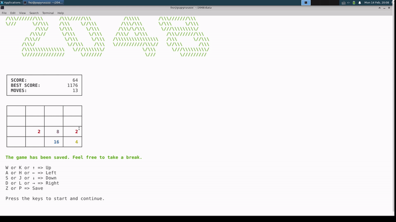

# 2048
\~2048游戏\~详细注释的代码\~全搭建过程笔记\~

# 项目介绍

菜单

游戏过程

排行榜

新游戏

继续游戏

排行榜

# 说明

首先需要声明的是，此游戏项目**并非本人原创**，原项目地址[在这里](https://github.com/plibither8/2048.cpp)。

在大三上这个寒假，我打算在github找一个的项目学习，目标是理解代码、复现程序，最终我挑中了这个2048游戏项目。

在我对原项目学习过程中，遇到了不少困难。例如，虽然项目体量不算很大，但也有二十多个文件，且注释不多，还用到了不少c++ 11后的新特性（如lambda表达式等）、我不太熟悉的库函数等等。在没有文档帮助情况，理解起来还是有不小难度，在我第一次尝试理解复现时，遇到了不少挫折，最终失败。

休整后，我第二次尝试理解并复现时，定下目标：边弄项目边做笔记，把所有曾经困惑我的疑惑的解答记在笔记中，目标是让曾经被该项目绕晕的我在笔记的帮助下也能顺利理解项目逻辑、复现程序。于是便有了现在这篇36k字的搭建记录。

在笔记中，我（自认为）较为详细的梳理了项目逻辑，能够做到让对本项目陌生的人也能较为轻松迅速地上手，并相较于原项目在代码中添加更丰富、详细的注释，旨在帮助初学者能更容易的阅读与理解代码。

如果您对2048游戏项目感兴趣，希望阅读源码进行学习，不客气的说，我的项目比原项目更适合初学者学习。

有了第一次失败的经验，第二次复现项目对我而言并不是很困难，但写就搭建记录花费了远超出我预期的时间。就在今天（2022/2/14），终于完工了，希望这篇记录能帮助更多的人学习该项目。

